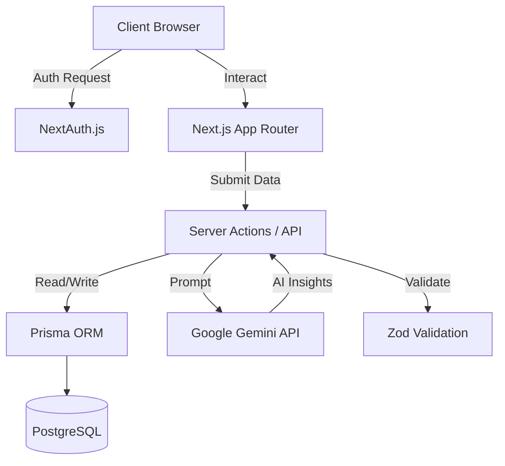
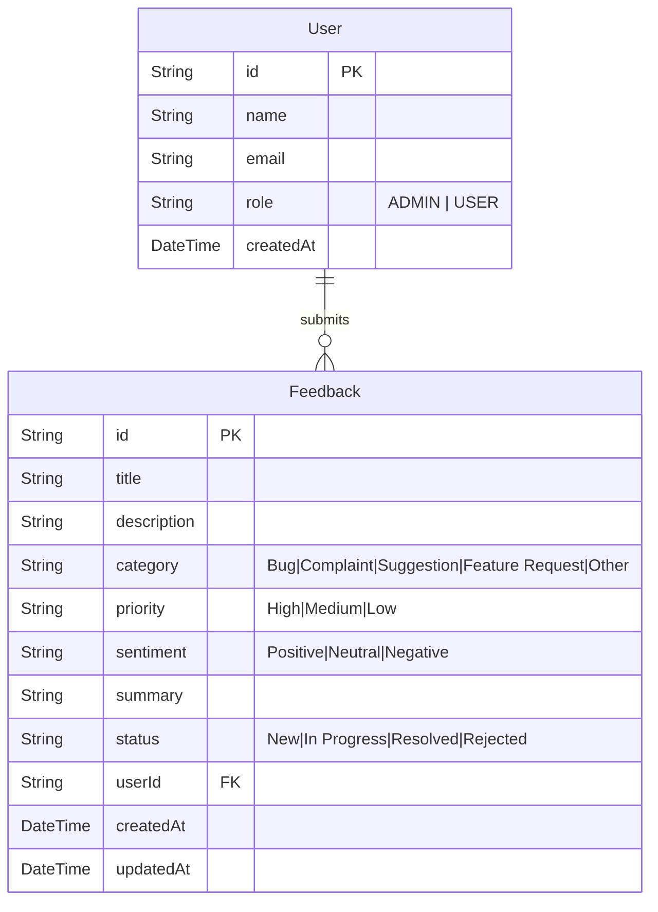

# AI-Powered Customer Feedback Portal

A modern, enterprise-grade SaaS web application that allows customers to submit feedback while administrators manage, prioritize, analyze, and resolve feedback using AI-powered insights.

Built for a Vibe Coding Assessment, showcasing AI-assisted development workflow, architecture, documentation, and engineering best practices.

## Table of Contents
1. [Project Overview](#project-overview)
2. [Target Users](#target-users)
3. [Technology Stack](#technology-stack)
4. [System Architecture](#system-architecture)
5. [Database ER Diagram](#database-er-diagram)
6. [API Documentation](#api-documentation)
7. [Development Roadmap](#development-roadmap)
8. [Folder Structure](#folder-structure)
9. [Setup Instructions](#setup-instructions)
10. [Deployment Guide](#deployment-guide)
11. [AI Integration Flow](#ai-integration-flow)
12. [Testing Strategy](#testing-strategy)
13. [Production Readiness Checklist](#production-readiness-checklist)
14. [Git Strategy & Commit History](#git-strategy--commit-history)

---

## Project Overview
The application solves the problem of businesses collecting feedback from multiple channels without having a centralized system to manage, categorize, prioritize, and track customer issues.

**Design Aesthetics**: Linear / Notion / Stripe Dashboard / Vercel Dashboard style. Clean, minimal, professional, and responsive.

## Target Users
### Customer
- Submit feedback
- Select category
- Track submitted feedback
- View feedback status

### Administrator
- View all feedback
- Manage feedback and change status
- Search and filter feedback
- View analytics
- Use AI-powered recommendations

---

## Technology Stack
- **Frontend**: Next.js 15, React 19, TypeScript, Tailwind CSS, Shadcn UI, Lucide Icons
- **Backend**: Next.js Server Actions, REST APIs, TypeScript
- **Database**: PostgreSQL (via Prisma ORM)
- **AI**: Gemini API
- **State Management**: Zustand
- **Forms**: React Hook Form, Zod Validation
- **Charts**: Recharts
- **Authentication**: NextAuth
- **Deployment**: Vercel

---

## System Architecture



---

## Database ER Diagram



---

## API Documentation
*This system primarily uses Next.js Server Actions for internal mutations, but exposes the following REST endpoints if external integrations are needed.*

### `POST /api/feedback`
- **Description**: Submit new customer feedback.
- **Body**: `{ title: string, description: string, category: string }`
- **Response**: `{ id: string, status: "NEW", createdAt: string }`

### `GET /api/feedback`
- **Description**: Retrieve feedback (Admin only).
- **Query Params**: `?status=NEW&category=BUG`
- **Response**: `[{ id: string, title: string, priority: string, sentiment: string, ... }]`

### `PATCH /api/feedback/:id`
- **Description**: Update feedback status.
- **Body**: `{ status: "RESOLVED" }`
- **Response**: `{ success: true, updatedFeedback: {...} }`

---

## Development Roadmap
Complete milestone-based development plan:

- **Milestone 1**: Project Setup (Next.js, Tailwind, Shadcn UI)
- **Milestone 2**: Authentication (NextAuth, Role-Based Access)
- **Milestone 3**: Database Design (Prisma, PostgreSQL)
- **Milestone 4**: Feedback CRUD (Submit Form, Dashboard List)
- **Milestone 5**: Admin Dashboard (UI layout, Filtering, Status Management)
- **Milestone 6**: AI Integration (Gemini API for categorization, priority, summary, sentiment)
- **Milestone 7**: Analytics (Recharts for Dashboard Insights)
- **Milestone 8**: Testing (Jest, React Testing Library)
- **Milestone 9**: Deployment (Vercel Configuration)

---

## Folder Structure
```text
src/
 ├── app/           # Next.js App Router: Routes, layouts, and API endpoints
 ├── actions/       # Server Actions for forms, data mutations, and AI calls
 ├── api/           # External-facing REST API routes
 ├── components/    # Reusable UI components (Shadcn UI, standard buttons, cards)
 ├── dashboard/     # Admin dashboard specific layout and components
 ├── features/      # Feature-specific logic (e.g., feedback submission, analytics)
 ├── hooks/         # Custom React hooks (e.g., useAuth, useFeedback)
 ├── services/      # External integrations (e.g., Gemini API service)
 ├── prisma/        # Prisma Client and Database schema configuration
 ├── lib/           # Utility libraries, Zustand stores, and NextAuth config
 ├── utils/         # Helper functions (date formatting, string manipulation)
 ├── types/         # Global TypeScript interfaces and Zod validation schemas
```

---

## Setup Instructions
1. Clone the repository: `git clone <repo-url>`
2. Install dependencies: `npm install`
3. Set up environment variables: Copy `.env.example` to `.env` and fill in `DATABASE_URL`, `NEXTAUTH_SECRET`, and `GEMINI_API_KEY`.
4. Run Prisma migrations: `npx prisma db push` (or `npx prisma migrate dev`)
5. Start development server: `npm run dev`
6. Access the application at `http://localhost:3000`.

---

## Deployment Guide
1. Push your code to a GitHub repository.
2. Log into **Vercel** and import the project.
3. Configure the following Environment Variables in Vercel settings:
   - `DATABASE_URL` (Your production PostgreSQL connection string)
   - `NEXTAUTH_SECRET` (A strong randomly generated string)
   - `NEXTAUTH_URL` (Your production domain, e.g., `https://my-app.vercel.app`)
   - `GEMINI_API_KEY` (Your Google Gemini API key)
4. Click **Deploy**. Vercel will automatically run the build step.
5. Setup a build step command in Vercel if necessary: `npx prisma generate && next build`.

---

## AI Integration Flow
1. **Trigger**: User submits a feedback form via a Server Action.
2. **Processing**: Server Action receives text data and securely calls the `Gemini API` service layer.
3. **Prompt Engineering**: The Gemini API is prompted to return a structured JSON response containing:
   - `category` (Bug, Suggestion, etc.)
   - `priority` (High, Medium, Low)
   - `sentiment` (Positive, Neutral, Negative)
   - `summary` (A concise 1-sentence summary)
4. **Storage**: The original feedback and the AI-generated insights are saved into PostgreSQL via Prisma.
5. **Display**: The Admin dashboard instantly queries and displays these insights to help administrators prioritize work.

---

## Testing Strategy
- **Unit Testing (Jest)**: Test utility functions, Zod schema validation rules, and isolated React components.
- **Integration Testing (React Testing Library)**: Test the interaction between components, especially the feedback submission form and state updates.
- **API Testing**: Test Server Actions and API Routes to ensure correct DB writes and accurate responses.

---

## Production Readiness Checklist
- [ ] Strict TypeScript mode enabled with no build errors.
- [ ] Environment variables secured and validated at runtime using `t3-env` or similar.
- [ ] NextAuth configured correctly with secure HTTP-only cookies.
- [ ] Rate limiting implemented on form submissions and API endpoints.
- [ ] XSS and CSRF protections enabled (handled largely by React/Next.js by default).
- [ ] Database indexes created for frequent queries (e.g., sorting by status, date).
- [ ] Error boundaries implemented for graceful fallback UI.
- [ ] Lighthouse performance score > 90.

---

## Git Strategy & Commit History
The repository utilizes conventional commits to ensure a clean, readable history. Below is a sample 30-commit strategy demonstrating professional development practices:

1. `chore: initialize Next.js 15 project structure`
2. `chore: install and configure Tailwind CSS and standard linting`
3. `chore: integrate Shadcn UI and add base component themes`
4. `feat: configure Prisma and PostgreSQL`
5. `feat: create initial User and Feedback Prisma schema`
6. `chore: setup NextAuth and environment variables`
7. `feat: implement authentication middleware`
8. `feat: add Credentials and OAuth providers to NextAuth`
9. `feat: create user login and registration pages`
10. `feat: implement role-based access control for admin routes`
11. `feat: setup Zustand for global state management`
12. `feat: create feedback submission API and server actions`
13. `feat: build customer feedback form with React Hook Form and Zod`
14. `feat: add customer-facing dashboard to track submitted feedback`
15. `feat: build base admin dashboard layout and navigation`
16. `feat: implement feedback data table with sorting and pagination`
17. `feat: add status update mutations for admin dashboard`
18. `feat: implement search and filtering for feedback lists`
19. `feat: setup Google Gemini API service layer`
20. `feat: integrate Gemini categorization service on feedback submission`
21. `feat: implement AI priority detection for incoming feedback`
22. `feat: add AI-generated concise summaries for long feedback`
23. `feat: implement AI sentiment analysis and store results`
24. `feat: integrate Recharts library for analytics`
25. `feat: add analytics dashboard charts (Feedback by Category)`
26. `feat: add sentiment distribution pie chart`
27. `refactor: extract and clean up feedback service layer`
28. `test: implement unit tests for utility functions and schemas`
29. `test: add integration tests for feedback submission flow`
30. `chore: configure production build settings and deploy application to Vercel`
